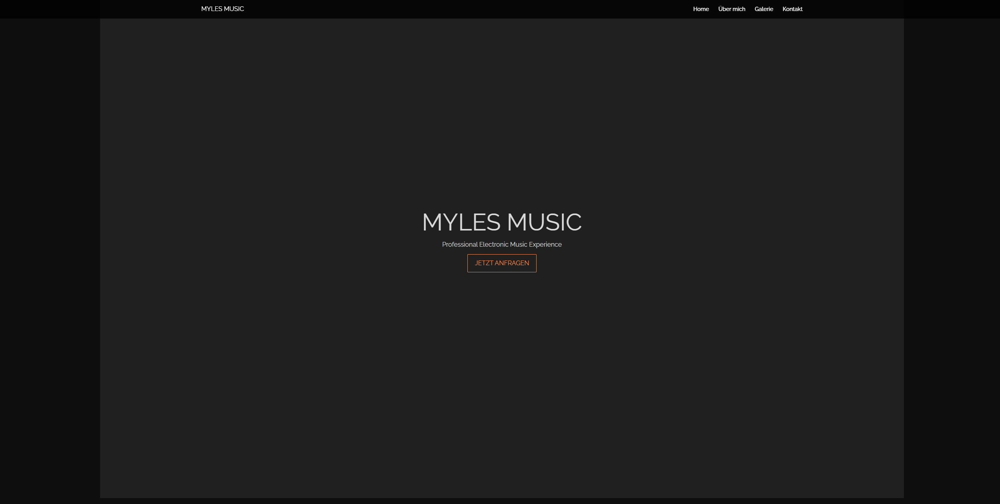
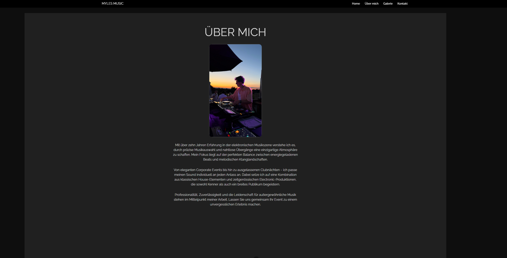
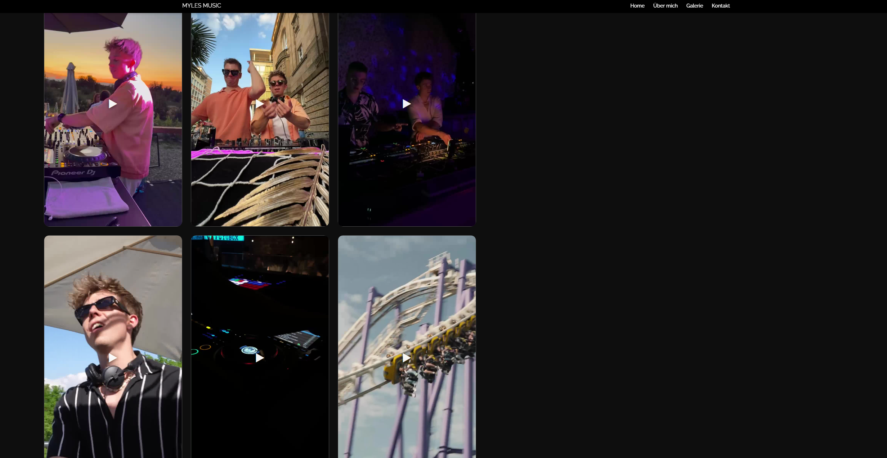
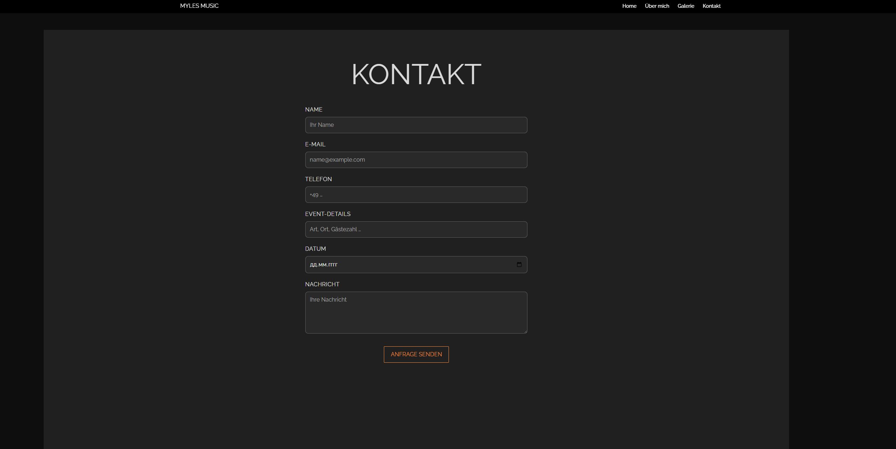

# MYLES MUSIC

**Myles Music** is a minimalistic one-page portfolio website for a professional electronic music artist.  
Built with **Vue 3 + Vite**, the site combines a clean, modern design with a dark aesthetic — showcasing the artist’s background, gallery, and contact form for booking requests.

---

## Live Overview

Sections included:

- **Home** — landing hero with title and CTA button
- **About Me** — short bio and introduction
- **Gallery** — photo & video impressions
- **Contact** — event inquiry form

---

## Tech Stack

- [Vue 3](https://vuejs.org/) (Composition API)
- [Vite](https://vite.dev/) for fast development
- [CSS3 / Flexbox] for layout
- [ESLint](https://eslint.org/) for code quality

---

## Screenshots

<table>
  <tr>
    <td></td>
    <td></td>
  </tr>
  <tr>
    <td></td>
    <td></td>
  </tr>
  
</table>

---

## Project Setup

```bash
# install dependencies
npm install

# compile and hot-reload for development
npm run dev

# compile and minify for production
npm run build

# lint the code
npm run lint
```
